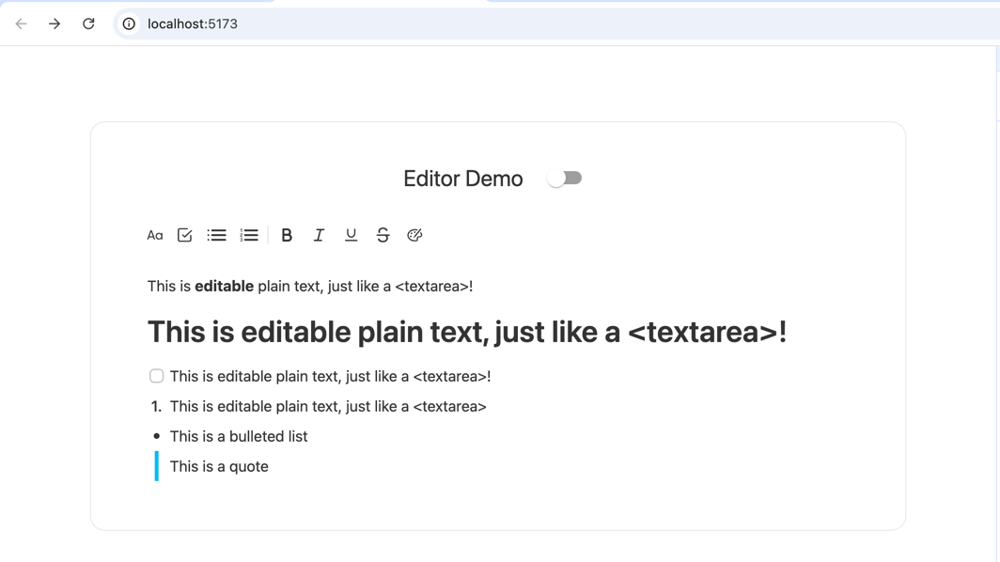
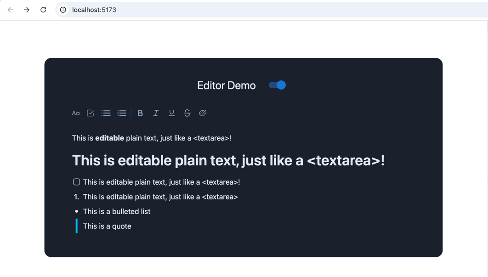

# AppFlowy Web Editor

A modern editor library with support for rich text, markdown, and code editing.

## ✨ Features

- 🌓 Day/Night mode switching
- 🌍 Multi-language support
- 📱 Responsive design
- 💪 TypeScript support
- 📝 Rich text, markdown, and code editing
- 📦 Easy to integrate
- 🎉 And more!

## 📦 Installation

To install the AppFlowy Web Editor, run the following command:

```bash
npm install @appflowyinc/editor

# or

yarn add @appflowyinc/editor

# or

pnpm add @appflowyinc/editor
```

Note: This package requires these peer dependencies to be installed:

```
"peerDependencies": {
    "react": "^18.3.1",
    "react-dom": "^18.3.1",
}
```

## 🚀 Quick Start

To use the AppFlowy Web Editor, import the `Editor` and `EditorProvider` components from the package and wrap your app

```tsx

import { Editor, EditorProvider } from '@appflowyinc/editor';

const App = () => {
  return <EditorProvider>
    <Editor/>
  </EditorProvider>
};

export default App;
```

## 📚 Apply Data

You can get `editor` from the `useEditor` hook and apply data to the editor.

```tsx
import { Editor, EditorProvider, useEditor, NodeType } from '@appflowyinc/editor';

const App = () => {
  const editor = useEditor();

  useEffect(() => {
    editor.applyData({
      type: NodeType.Paragraph,
      delta: [
        {
          insert: 'Hello, World!',
        },
      ],
      children: []
    });
  }, []);

  return
  <Editor/>;
};

const Main = () => {
  return <EditorProvider>
    <App/>
  </EditorProvider>;
};

export default App;
```

## 💡 Theme Switching

The AppFlowy Web Editor supports theme switching between light and dark modes. You can customize the themes by passing
the `theme` prop to the `Editor` component.

```tsx
import { Editor, EditorProvider } from '@appflowyinc/editor';

const App = () => {
  return <EditorProvider>
    <Editor theme={'dark'}/>
  </EditorProvider>;
};

export default App;
```

## 🌍 Multi-language Usage

The AppFlowy Web Editor supports multiple languages. You can customize the language by passing the `language` prop to
the `Editor` component.

```tsx

import { Editor, EditorProvider } from '@appflowyinc/editor';
// Optionally, you can import the language resources from the package
import zh from '@appflowyinc/editor/locales/zh-CN.json';

const App = () => {
  return <EditorProvider>
    <Editor locale={{
      // The language code.
      lang: 'zh-CN',
      // Optionally, you can pass the language resources or let it use the default resources
      resources: zh,
    }}/>
  </EditorProvider>;
};

export default App;
```

### Supported Languages

- English(en)
- Arabic(ar-SA)
- Catalan(ca-ES)
- Central Kurdish(ckb-KU)
- Czech(cs-CZ)
- German(de-DE)
- Spanish(es-VE)
- Basque(eu-ES)
- Persian(fa)
- French(fr-CA)
- French(fr-FR)
- Hebrew(he)
- Hungarian(hu-HU)
- Indonesian(id-ID)
- Italian(it-IT)
- Japanese(ja-JP)
- Korean(ko-KR)
- Polish(pl-PL)
- Brazilian Portuguese(pt-BR)
- Portuguese(pt-PT)
- Russian(ru-RU)
- Swedish(sv-SE)
- Thai(th-TH)
- Turkish(tr-TR)
- Ukrainian(uk-UA)
- Vietnamese(vi)
- Vietnamese(vi-VN)
- Simplified Chinese(zh-CN)
- Traditional Chinese(zh-TW)

## 📖 API

### Editor Props

| Prop         | Type                                                   | Default   | Description                          |
|--------------|--------------------------------------------------------|-----------|--------------------------------------|
| theme        | `'light' \| 'dark'`                                    | `'light'` | Editor theme                         |
| locale       | `{ lang: string; resources?: Record<string, string> }` | -         | Editor language configuration        |
| readOnly     | `boolean`                                              | `false`   | Whether the editor is read-only      |
| onChange     | `(data: EditorData) => void`                           | -         | Callback when editor content changes |
| initialValue | `EditorData`                                           | -         | Initial editor content               |

### EditorProvider Props

| Prop     | Type        | Default | Description             |
|----------|-------------|---------|-------------------------|
| children | `ReactNode` | -       | The children components |

### EditorData

```ts
type EditorData = {
  type: NodeType;
  data: Record<string, any>;
  delta: DeltaOperation[];
  children: EditorData[];
};
```

### NodeType

```ts

enum NodeType {
  Paragraph = 'paragraph',
  Heading = 'heading',
  NestedBlock = 'nested-block',
  Todo = 'todo_list',
  NumberedList = 'numbered_list',
  BulletedList = 'bulleted_list',
  Quote = 'quote',
}
```

### Hooks

#### useEditor

Returns the editor instance with methods to control the editor.

```ts
const editor = useEditor();
```

| Method    | Description              |
|-----------|--------------------------|
| applyData | Apply data to the editor |

## 🔨 Development

Guide

###

Development
Mode

```

# Install dependencies

pnpm i

# Start development server

pnpm run dev

# Build library

pnpm run build

```

To run the demo locally:

```bash
pnpm install
pnpm run dev
```

Open [http://localhost:5173/](http://localhost:5173/) with your browser to see the result.


Switch between light and dark mode by clicking the theme switcher in the top right corner.


## 📄 License

MIT License

```

[]: # (END) README.md


